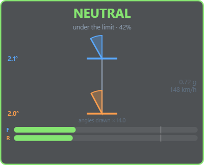
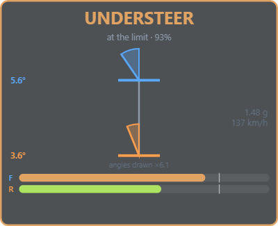
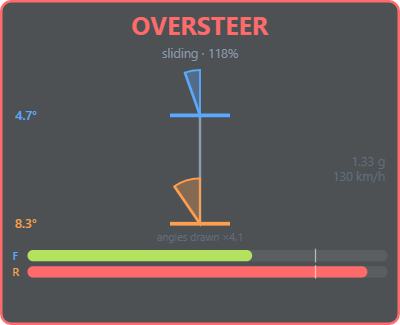
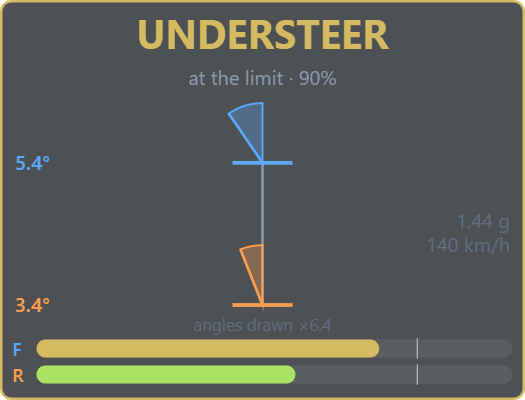
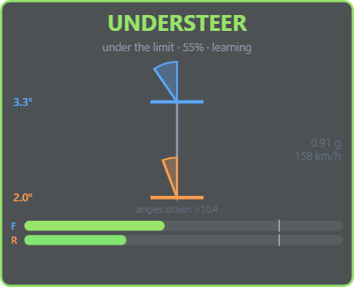
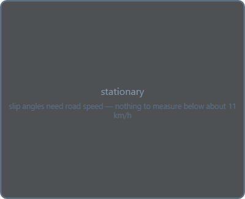
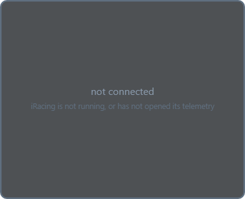
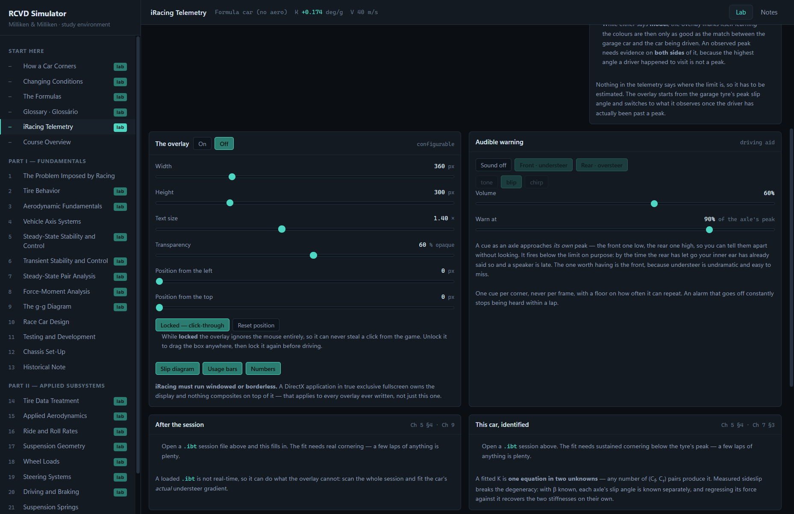

# RCVD Simulator

An interactive study environment for **Race Car Vehicle Dynamics** (Milliken &
Milliken, SAE 1995), built around 23 chapters of companion notes in `docs/`.

Every chapter renders its notes with the mathematics typeset. Twenty-one of them
add a **Lab**: move a parameter, watch every dependent quantity move with it.
And when you go driving, the same models read your iRacing telemetry and put a
slip-angle overlay on screen.

<p align="center">
  
  
  
</p>

> The overlay while driving. The wider shaded angle is the end giving up — that
> is the whole definition of understeer. The colour is a *different* question:
> how close to the limit the car is.

---

## Contents

- [The idea it is built around](#the-idea-it-is-built-around)
- [Reading it alongside the book](#reading-it-alongside-the-book) ← **start here**
- [The garage](#the-garage)
- [iRacing telemetry and the overlay](#iracing-telemetry-and-the-overlay)
- [Running it](#running-it)
- [What is in each lab](#what-is-in-each-lab)
- [Layout](#layout)
- [Correctness](#correctness)
- [Corrections to the notes](#corrections-to-the-notes)

---

## The idea it is built around

A tyre makes lateral force **only by slipping** — by pointing slightly away from
the direction it is actually travelling. Understeer and oversteer are nothing
more than *which axle is slipping more*.

**Start here** draws exactly that: the car from above, with the angle between
where each wheel points and where it is actually going shaded in. Front angle
bigger than rear is understeer. That is the whole definition, and it takes one
look rather than a paragraph.

Real slip angles are only a few degrees, so every angle is drawn multiplied by
an exaggeration factor — auto-scaled and always stated on screen. Because every
angle uses the *same* factor the construction stays exact: the angles still add
up to `δ = L/R + (αf − αr)`.

---

## Reading it alongside the book

**The order matters, and it is not the order the chapters are printed in.** The
book is a reference organised by subsystem; learning it works better in passes,
because Chapter 7 needs Chapter 18's wheel loads and Chapter 18 needs Chapter
17's geometry, both of which come later in the numbering.

The sequence below is the one in `docs/00-course-overview.md` §5, with the lab
to open at each step. Read the book chapter first, then work the lab, then do
the exercises in the app's **Exercises** tab — solutions stay hidden until you
ask.

### Before anything else

Open **Start here — How a Car Corners** and spend ten minutes on it. It is one
picture and five experiments, and everything afterwards is a refinement of it.
Then skim **Glossary** if English is not your first language — it is bilingual
EN ⇄ PT-BR and flags the terms Brazilian motorsport keeps in English.

### First pass — theory · Chapters 1, 2, 4, 5, 6, 9

The minimum coherent path. Work **every exercise in Chapters 2 and 5**; they
carry the most weight.

| Read | Then open | Look for |
|---|---|---|
| Ch 1 | *(notes only)* | Lap-time sensitivity, the single friction budget |
| **Ch 2** | **Tire Behavior** | The contact-patch view. Watch the sliding zone eat the patch as slip angle rises — it explains the force peak, pneumatic trail and the steering-torque warning at once |
| Ch 4 | *(notes only)* | Body axes and the transport term `Ay = V·r` |
| **Ch 5** | **Steady-State Stability and Control** | The understeer gradient as a *difference of two nearly equal numbers* — that is why balance is delicate. Then the understeer budget table |
| **Ch 6** | **Transient Stability and Control** | The animated step steer: where the car points vs where it goes, separating immediately |
| Ch 9 | **The g-g Diagram** | The envelope is *solved*, not sketched. Then the usage overlay: a blended lap scores 70%+ of the envelope, an amateur "notch" scores 9% |

Also useful here: **The Formulas** — 17 equations, each with your numbers
written into it, decomposed into terms, and swept on a chart.

### Second pass — the limit · Chapters 7, 8, 14, 18

Where linear theory gives way to what happens at 1.5–3 g. **Read Ch 18 before
Ch 7**, even though it is numbered later: pair analysis consumes the wheel loads
Ch 18 produces.

| Read | Then open | Look for |
|---|---|---|
| **Ch 18** | **Wheel Loads** | Turn a bar: the *split* moves while the total does not budge. That is all of balance tuning in one readout |
| **Ch 7** | **Steady-State Pair Analysis** | The TLLTD sweep. Also the lesson that this car's bars *cannot* make it neutral — a grip difference is a primary effect no bar undoes |
| Ch 14 | **Tire Data Treatment** | The collapse — five loads onto one curve. Then break it with the shape-drift slider, because a demonstration that cannot fail is not a demonstration |
| **Ch 8** | **Force-Moment Analysis** | The map's N = 0 line reproducing Ch 7 exactly, and understeer decomposing into stability ÷ control |

### Third pass — hardware · Chapters 16, 17, 21, 22, 23

A tight cluster. **Read Ch 17 before Ch 16**: geometry sets the roll centres
that the rate calculation needs.

| Read | Then open | Look for |
|---|---|---|
| **Ch 17** | **Suspension Geometry** | One point — the instant centre — setting camber gain, roll centre and load-transfer split together. You cannot move one alone |
| **Ch 16** | **Ride and Roll Rates** | Installation ratio is *squared*; the tyre is one of two springs in series. Then press **Send these rates to the car** and watch Ch 7's TLLTD move |
| Ch 21 | *(notes only)* | Coil and torsion rates, Goodman fatigue |
| **Ch 22** | **Dampers** | A damper makes no force at steady state, so it cannot move steady-state balance — only the transient. Load a session for the velocity histogram |
| **Ch 23** | **Compliances** | The series relation, twice: why a bigger bar delivers a third of what you asked for |

### Fourth pass — the rest · Chapters 3, 15, 19, 20

Largely self-contained.

| Read | Then open | Look for |
|---|---|---|
| Ch 3 / 15 | **Aerodynamics** | Grip stops being a property of the car and becomes a property of the car *at a speed* |
| **Ch 19** | **Steering Systems** | The caster trade made numeric: camber gain bought with the front-limit warning |
| Ch 20 | **Driving and Braking** | One sign explains every drivetrain layout. Then the differential priced in degrees of opposite lock |

### Throughout — Chapters 10, 11, 12, 13

Read alongside, not in sequence. **Chapter 12 is worth revisiting after every
other chapter** — it is where each new piece of theory acquires a practical
consequence. **Changing Conditions** is the lab that goes with it.

---

## The garage

One car and one tyre set are carried through every chapter, which is the study
method the course overview recommends:

> *"Carry a specific car and a specific problem through it … at each chapter
> compute that car's numbers."*

A change made in the Ch 2 tyre lab is visible in the Ch 5 understeer gradient
immediately. The app starts self-consistent — the linear model's `Cf` and `Cr`
are the ones the tyre set actually produces at the car's static loads — and
tells you when they have drifted apart.

Three places push a derived result back into the garage, which is the app's
spine:

- **Ch 2 → Ch 5**: *Set Cf, Cr from the Ch 2 tyres*
- **Ch 16 → Ch 18**: *Send these rates to the car* (springs and bars become roll stiffness)
- **Telemetry → everywhere**: *Use this car everywhere* (measured stiffnesses from your own laps)

---

## iRacing telemetry and the overlay

Open the **iRacing Telemetry** lab (under *Start here*).

### Before you start

**iRacing must run in windowed or borderless mode.** A DirectX application in
true exclusive fullscreen owns the display and nothing composites on top of it —
that is true of every overlay ever written, not just this one.

Everything else works without iRacing running, using the **Synthetic** source or
a saved `.ibt` file.

### Live overlay, step by step

1. Start the app (`npm run dev`, or the built installer).
2. Go to **iRacing Telemetry**.
3. Under *Where the data comes from*, choose **iRacing**. The status line tells
   you what is happening — "iRacing is not running", "no session is live",
   or "connected — *n* channels at 60 Hz".
4. In *The overlay*, switch it **On**.
5. Position it: drag the **Position** sliders, or press **Unlocked — drag to
   move**, drag the box where you want it, then lock it again.

| Setting | What it does |
|---|---|
| **Width / Height** | Box size, 180–900 × 140–800 px |
| **Text size** | 0.6× to 2.5×, independent of box size |
| **Transparency** | 15–100% opaque |
| **Position** | From the left and top of the screen; *Reset position* puts it top-right |
| **Locked** | Click-through, so it can never steal an input from the game. Unlock only to move it |
| **Slip diagram / Usage bars / Numbers** | Turn off what you do not want |

Settings persist between runs.

### Reading the box

<p align="center">
  
  
</p>

*Left: default size. Right: the same information at 1.6× text on a larger box.*

**Two signals, and they are free to disagree.**

- **The word** — NEUTRAL / UNDERSTEER / OVERSTEER — says *which end* is giving
  up first. It is the difference between the two slip angles.
- **The colour** — green → amber → red — says *how close to the edge* the car
  is: the larger of the two axles' share of its own peak slip angle.

A car can be strongly understeering at 40% of its grip. That is green **and**
understeer at once, and it is correct.

| Element | Meaning |
|---|---|
| Shaded angles | Front (blue) and rear (orange) slip angles. **The wider one is the end giving up** |
| `angles drawn ×N` | The exaggeration factor. Real slip angles are a few degrees and would be invisible; every angle uses the same factor |
| **F** / **R** bars | Each axle's use of its own peak slip angle. The white tick is 100% |
| `1.48 g` / `137 km/h` | Lateral acceleration and speed |
| `· learning` | The limit is still the *modelled* one — see below |

### "learning", and why the colours need calibrating

<p align="center">
  
</p>

Nothing in telemetry says where the limit is, so it has to be estimated. The
overlay starts from the **garage tyre's** peak slip angle and switches to what
it **observes** once you have actually driven past a peak at that axle.

While either axle is still on the modelled value the box appends `· learning`,
and the colours are only as good as the match between the garage car and the car
you are driving. The observed estimate deliberately requires evidence on *both
sides* of a candidate peak — the highest angle you happened to visit is not a
peak, and that is the commonest way this could lie to you.

### Stopped, and stationary

<p align="center">
  
</p>

Below about 11 km/h the box says **stationary** and shows nothing else. That is
deliberate, and it is the honest answer rather than a missing feature.

Every angle the overlay draws is built on `a·r/V` and `atan2(vy, vx)`, and both
fall apart as `V` goes to zero — the first by dividing by it, the second because
the arctangent of two near-zero numbers is arbitrary. A parked car still reports
a little yaw-sensor noise, so a naive division turns microradians into hundreds
of degrees of slip. The box would show vivid, confident, entirely fictional
readings while the car sat still in its pit box.

The alternative of showing a calm green **NEUTRAL** would be worse, not better:
that is a claim about the car, made when there is nothing to base it on.

### If nothing appears

<p align="center">
  
</p>

The box always says why. Common causes:

| It says | Do this |
|---|---|
| *iRacing is not running…* | Start iRacing and join a session |
| *no session is live* | You are in the menus; go on track |
| *was denied access (error 5)* | iRacing is running elevated and this app is not, or the reverse. Start both the same way |
| *needs Windows* | The live source is Windows-only; use a `.ibt` file or Synthetic |
| *koffi FFI module could not be loaded* | `npm install` did not complete; re-run it |
| Nothing at all over the game | iRacing is in exclusive fullscreen — switch to borderless |

If the box is stuck on one of these and you disagree with it, two commands
answer directly rather than by inference:

```bash
npm run diagnose:irsdk
```

reports what Windows says about the mapping itself — whether it exists, whether
this process may read it, and how big it is. Then, with a session live:

```bash
npm run live:check
```

attaches for twenty seconds and prints the sample rate, which channels the car
publishes, the range of every signal, and the sign check. Drive a few corners
while it runs.

**If the corners read the wrong way round**, a channel sign is inverted.
`Ay = V·r` is a kinematic identity, so a disagreement between those two channels
is provable from the data alone; `live:check` reports it rather than absorbing
it. Tell me what it says and it is a one-line fix.

### After the session

Choose **Open .ibt…** and pick a session file (iRacing writes them to
`Documents\iRacing\telemetry`). Then:

- **This car, identified** — fits your car's actual `Cf` and `Cr` from ordinary
  laps. Two independent regressions cross-check each other, and **Use this car
  everywhere** is disabled unless both that check and a conditioning test pass.
  Writing a number that failed its own checks into the garage would spread one
  bad measurement through twenty labs.
- **Where the time went** — two laps compared **by distance, not time**. Read
  the *slope* of the delta trace: where it climbs is where time is lost, and a
  flat stretch means the laps were equal there.
- **Ch 22 → Dampers** — *Open a .ibt session…* draws the damper velocity
  histogram on the same axis as your force–velocity curve. A knee sitting where
  the histogram is empty is a setting with no effect.

> **Verified against real iRacing**, on a Toyota Supra at Richmond: 322 channels
> at a measured 60.0 Hz, every channel this app reads published, and `Ay` and
> `V·r` agreeing on 100% of cornering samples — which settles the sign
> conventions the adapter previously had to assume. `npm run live:check` repeats
> that check on your own car. Those samples were all left-hand (Richmond is an
> oval), so a road course would be a stronger test; the failure that matters,
> one channel inverted rather than all of them, would already have shown up.

### Audible warnings

<p align="center">
  
</p>

Optional, and **off until you turn them on** — a sound you did not ask for
arriving mid-corner is a hazard, not an aid.

A cue fires as an axle approaches **its own** peak. The front cue is low, the
rear cue is high, so you can tell them apart without looking, which is the only
reason to use sound at all.

Three things about the design are worth knowing, because they are what separate
a driving aid from a car alarm:

- **It fires below the limit, not at it.** By the time the rear has let go your
  inner ear has already told you and a speaker is late. The tenth before that is
  what you cannot feel. Adjustable from 60% to 98% of the axle's peak — it will
  not let you set it to 100%, because a cue that waits for the event is a report.
- **The front one is the one to keep.** Oversteer announces itself. Understeer is
  undramatic, easy to miss, and is where the time goes.
- **One cue per corner, never per frame.** Usage hovering at the threshold would
  otherwise retrigger sixty times a second. It has to fall clearly back below
  before it can speak again, and there is a floor on how often it can repeat so
  a chicane does not become a burst.

Sounds are synthesised, not sampled — nothing to ship, and *tone*, *blip* and
*chirp* are genuinely different rather than three files.

---

## Running it

```bash
npm install
npm run dev
```

| Command | What it does |
|---|---|
| `npm run dev` | The desktop app. Telemetry and the overlay need this |
| `npm run dev:web` | Labs in a plain browser; no Electron, no telemetry |
| `npm test` | 697 unit tests |
| `npm run smoke` | 107 checks in a real Electron window — IPC, every lab, the overlay |
| `npm run capture:overlay` | Regenerate the screenshots in `docs/images/` |
| `npm run dist` | A Windows installer into `release/` |

---

## What is in each lab

| Chapter | Lab | What it does |
|---|---|---|
| **Start here** | How a Car Corners | The cornering diagram, a plain-language verdict, five guided experiments |
| **Start here** | Changing Conditions | Fuel, wear, temperature, pressure, track grip; A/B compare, stint timeline, sensitivity ranking |
| **Start here** | The Formulas | 17 equations, live-substituted, decomposed into terms, swept on a chart |
| **Start here** | Glossary · Glossário | 248 terms EN ⇄ PT-BR, accent-insensitive search |
| **Start here** | iRacing Telemetry | Live slip angles, the overlay, audible cues, post-session identification and lap comparison |
| 2 | Tire Behavior | Contact patch, Magic Formula and brush, load sensitivity, trail collapse, friction ellipse |
| 3 / 15 | Aerodynamics | Downforce and drag, aero balance, the speed-dependent cornering limit |
| 5 | Steady-State Stability and Control | Understeer gradient, skid pad, response gains, significant speeds, the six-row understeer budget |
| 6 | Transient Stability and Control | Animated step steer, modal parameters, root locus, frequency response |
| 7 | Steady-State Pair Analysis | Axle characteristics at real loads, TLLTD sweep, corner phase |
| 8 | Force-Moment Analysis | The MMM carpet plot, trim line, stability ÷ control, balance loss |
| 9 | The g-g Diagram | The solved envelope, the g-g-V surface, capability vs usage |
| 14 | Tire Data Treatment | Radt normalisation, the collapse and how to break it, the friction ellipse as a theorem |
| 16 | Ride and Roll Rates | Springs → wheel rates → ride rates → roll stiffness, and out to the rest of the app |
| 17 | Suspension Geometry | Instant centre construction drawn, camber budget, geometric transfer |
| 18 | Wheel Loads | Four-corner diagram, the three-way transfer split, TLLTD, roll gradient |
| 19 | Steering Systems | Ackermann, trail and feedback quality, compliance steer, bump steer |
| 20 | Driving and Braking | Traction by layout, differentials as a yaw moment, brake bias, disc thermals |
| 22 | Dampers | Force–velocity curve, mode separation, transient balance, load variation, velocity histogram |
| 23 | Compliances | The series relation, compliance steer and camber, chassis dilution |
| 1, 4, 10, 11, 12, 13, 21 | — | Notes and exercises. These chapters argue rather than compute |

Every chapter also has an **Exercises** tab: the notes' 147 exercises one at a
time, solutions withheld until asked for, progress remembered.

---

## Layout

```
src/
  core/            pure physics, no UI imports, fully unit-tested
    tire/          Magic Formula, brush/Fiala, load sensitivity, Radt normalisation
    vehicle/       bicycle model, wheel loads, pair analysis, Moment Method,
                   rates, geometry, steering, dampers, compliances
    performance/   g-g envelope, driveline and brakes
    conditions/    fuel, wear, temperature, pressure, track grip
    util/          numerics — RK4, root finding, eigenvalues
  telemetry/       irsdk layout, live and .ibt sources, state estimation,
                   identification, histograms, lap comparison, audible cues
  renderer/        React labs and charts, plus the canvas overlay
  main/, preload/  Electron shell, overlay window, settings
docs/              the 23 chapters of notes, the glossary, images
```

`src/core` has no dependency on React or Electron. It is a vehicle dynamics
library that happens to have an app attached, and can be used from a script or
a notebook on its own.

---

## Correctness

The physics is checked against the worked solutions in the notes. **Where a
chapter quotes a number, that number is the assertion** — Ex 2.1's 11.8°
full-slide angle, Ex 16.1's 2.57 Hz, Ex 18.2's full three-mass chain, Ex 20.1's
0.80 g of rear-drive traction, Ex 22.5's 3.5-point transient TLLTD shift, and
about sixty more.

The load-bearing tests are the **cross-chapter** ones, because they catch the
failure mode Ch 4 warns is the most common in the subject:

- the Ch 6 step response settles onto the Ch 5 steady-state gains exactly
- Ch 8's N = 0 trim line reproduces the Ch 7 pair-analysis limit, *in the app*
- Ch 8's stability ÷ control collapses to Ch 5's `Wf/Cf − Wr/Cr`
- the Ch 5 understeer budget's ideal-suspension case is the basic row plus the
  Ch 2 aligning-torque row, exactly
- ω\_n → 0 at the same speed the Ch 5 stability factor reaches zero
- the Formula playground's equations are tested against the models they restate,
  so a playground cannot drift from the simulator it explains

`npm run smoke` covers what unit tests cannot: it launches the compiled main
process and drives the real UI — IPC and path traversal, every lab's readouts,
the overlay window's flags and that it paints, the telemetry pipeline, and a
synthetic `.ibt` parsed through the genuine file path. 107 checks.

One thing no test can reach is the live connection to iRacing, because it needs
the simulator. `npm run live:check` is the substitute, and running it against a
Toyota Supra at Richmond settled the question the adapter could only assume:

- 322 channels at a measured **60.0 Hz**
- every channel this app reads is published, including `VelocityY`, so sideslip
  is measured rather than integrated — it ranged −3.93° to −0.44°
- **`Ay` and `V·r` agree on 100% of cornering samples**, and steer agrees with
  yaw rate on 98%, so the sign conventions are right

That last point was the open risk in the whole telemetry stack. It is closed for
this car; a car that publishes different signs would be caught by the same check
rather than silently drawing the overlay backwards.

---

## Corrections to the notes

Building the labs surfaced two arithmetic errors in the companion notes. Both
are fixed in `docs/`, with the correct working shown:

| Where | Was | Is |
|---|---|---|
| **Ch 17 Ex 17.1** | Roll centre 438 mm *above* ground | **165 mm below** — the solution mixed the wheel-local and vehicle frames, then dropped a sign on a descending line |
| **Ch 14 Ex 14.1** | `F̄ = 0.5520`, 3423 N | **0.5648, 3502 N** — the master curve's cubic term was off by a factor of ten |

In both cases the chapter's *conclusion* survived and one of them got stronger:
an outboard instant centre burying the roll centre underground is a worse
objection to that geometry than a high roll centre would have been. The tests
now describe the trap rather than the error — for Ex 17.1, that mixing the two
coordinate frames is the easy mistake, and a test guards it.

These are separate from the corrections the notes' own author records in
`docs/00-course-overview.md` §9, which were made before this app existed.

---

## A note on sign conventions

Ch 2 §9: *"the single most common source of error in vehicle dynamics work is
inconsistent sign convention."* This codebase uses the practitioner convention
throughout, stated at the top of `src/core/tire/types.ts`: vertical load positive
in compression, positive slip angle producing positive lateral force, and
positive lateral acceleration, yaw rate and steer all to the left. Strict SAE
flips the first two.

---

## Source material

The `docs/` notes are original explanatory material written to accompany
Milliken & Milliken and reproduce none of the book's content. The book itself
remains the reference; this is a companion, not a substitute.
